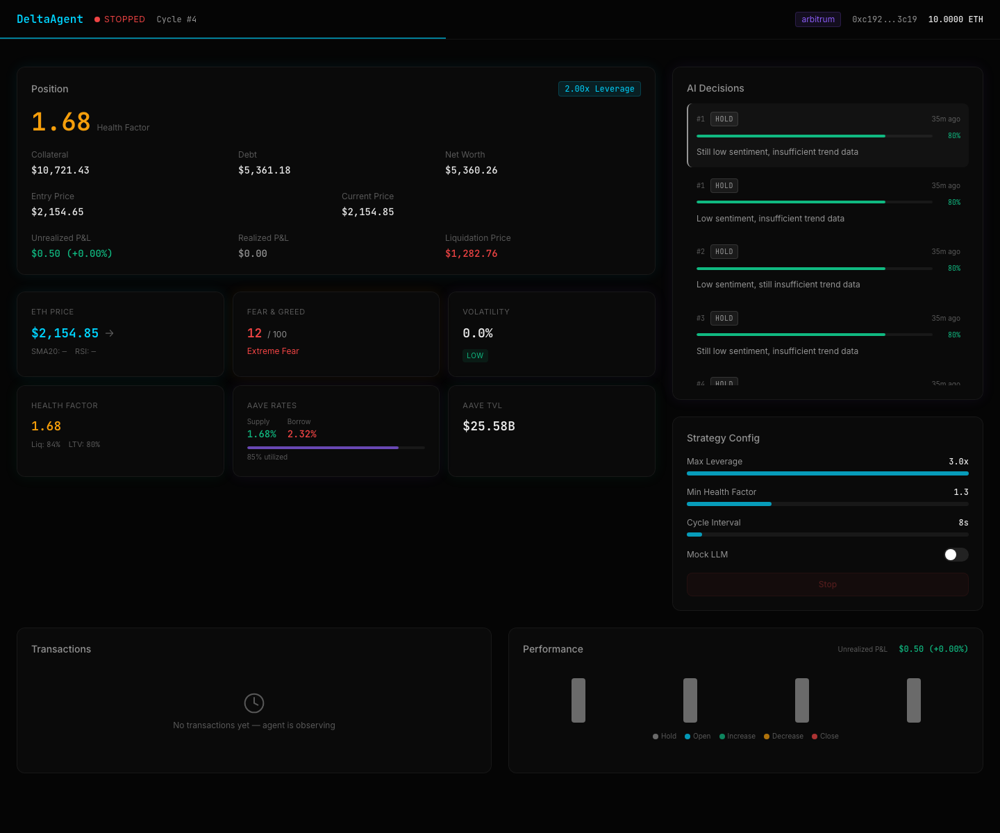
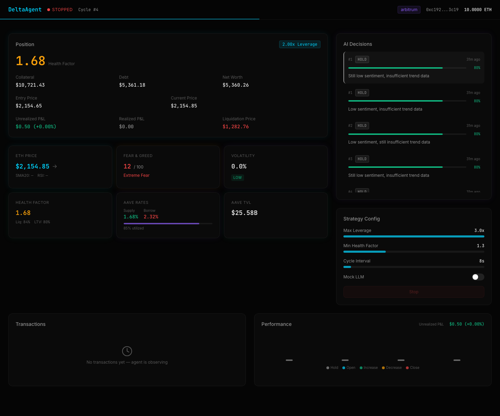
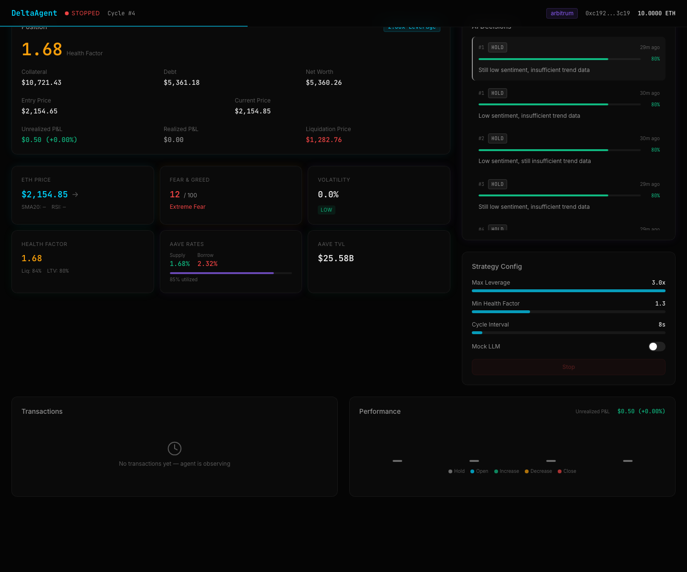
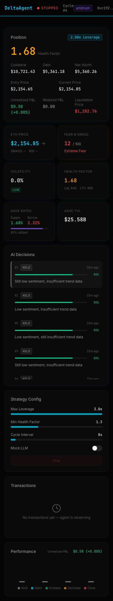
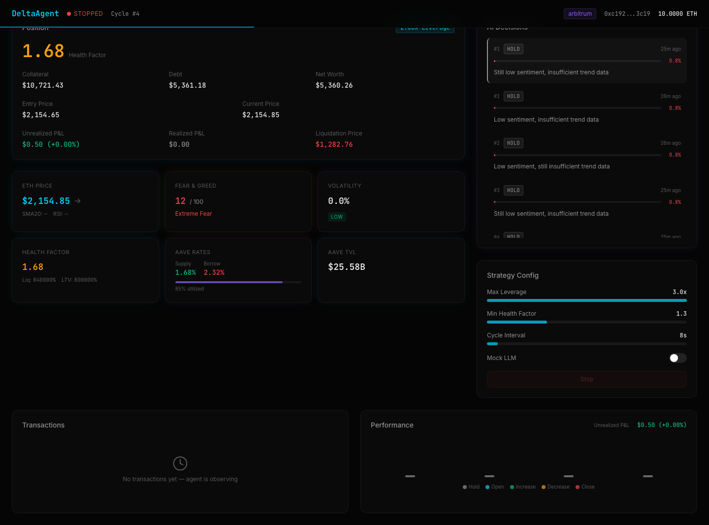

# DeltaAgent: Autonomous Leveraged ETH Position Manager

An AI agent that manages leveraged ETH long positions on Aave V3 (Arbitrum) using real-time market signals and LLM-driven decision-making.

[](https://www.typescriptlang.org/)
[](https://reactjs.org/)
[](https://aave.com/)
[](LICENSE)



---

## What Is DeltaAgent?

DeltaAgent is an autonomous DeFi agent that supplies WETH as collateral on Aave V3, borrows USDT0, and manages its leverage ratio based on aggregated market signals. An LLM (Llama 3.3 70B via Groq) analyzes price trends, health factors, sentiment, volatility, and protocol TVL each cycle to decide whether to open, increase, decrease, close, or hold the position.

---

## Screenshots

| Dashboard Overview | Signals Tab |
|---|---|
|  |  |

| Mobile View | Full Page |
|---|---|
|  |  |

---

## Features

- **LLM-Driven Decisions**: Each cycle, Groq's Llama 3.3 70B analyzes 6 signal categories and returns a structured trading action with confidence scoring
- **Aave V3 Integration**: Supply WETH, borrow USDT0, manage health factor. All on-chain operations via Tether's Wallet Development Kit (WDK)
- **Safety-First Design**: Hard leverage cap (3.0x), minimum health factor enforcement (1.3), circuit breaker after 3 consecutive failures, emergency exit mode
- **Real-Time Dashboard**: React 19 + Tailwind v4 dashboard with live position tracking, signal visualization, decision feed, transaction history, and runtime config
- **Volatility Gating**: Agent skips new positions when rolling volatility exceeds configurable threshold
- **Profit Disbursement**: Configurable percentage of realized profit auto-sent to treasury address on position close
- **Mock Mode**: Full agent loop with deterministic mock LLM responses for development without burning API tokens

---

## Tech Stack

| Layer | Technology |
|---|---|
| Agent Runtime | TypeScript, Node.js (tsx) |
| LLM | Groq API (Llama 3.3 70B Versatile) |
| On-Chain | Aave V3, Velora Swap, Uniswap V3 (fallback) on Arbitrum |
| Wallet | Tether WDK (EVM wallet, lending, swap, pricing modules) |
| Dashboard | React 19, Vite, Tailwind CSS v4 |
| API | Express 5 (REST, 3 endpoints) |

---

## How It Works

```
                    30s cycle
                        |
  Signal Aggregator ----+----> AI Brain (Groq LLM)
  |                              |
  +-- ETH/USD Price              +-- OPEN_POSITION
  +-- SMA20, RSI14               +-- INCREASE
  +-- Health Factor              +-- DECREASE
  +-- Fear & Greed Index         +-- CLOSE
  +-- Aave TVL + Rates           +-- HOLD
  +-- Rolling Volatility              |
                                      v
                              Execution Engine
                              |
                              +-- WDK Supply (WETH -> Aave)
                              +-- WDK Borrow (USDT0 from Aave)
                              +-- Velora/Uniswap Swap
                              +-- Profit Disbursement
                                      |
                                      v
                              Dashboard API (Express)
                              |
                              +-- /api/state    GET
                              +-- /api/config   POST
                              +-- /api/control  POST
```

---

## API Reference

| Method | Endpoint | Description |
|---|---|---|
| GET | `/api/state` | Full agent state: position, signals, decisions, transactions |
| POST | `/api/config` | Update runtime config (leverage limits, thresholds, toggles) |
| POST | `/api/control` | Agent control: `{ action: "pause" \| "resume" \| "stop" }` |

All endpoints accept an optional `Authorization: Bearer <token>` header when `API_TOKEN` is set.

---

## Running Locally

### Prerequisites

- Node.js 20+
- An Arbitrum RPC endpoint (Alchemy, Infura, or local Anvil fork)
- Groq API key (free tier works)
- A funded wallet (seed phrase with ETH on Arbitrum for gas + WETH for collateral)

### Setup

```bash
git clone https://github.com/dmustapha/deltaagent.git
cd deltaagent

# Install backend dependencies
npm install

# Install dashboard dependencies
cd dashboard && npm install && cd ..

# Configure environment
cp .env.example .env
# Edit .env with your keys
```

### Run in Mock Mode (no real transactions)

```bash
npm run dev
```

This starts the agent with `USE_MOCK_LLM=true`. The LLM is replaced with deterministic mock responses. No Groq tokens consumed, no on-chain transactions.

### Run with Real LLM

```bash
npm start
```

Requires valid `GROQ_API_KEY` and funded wallet. The agent will execute real transactions on Arbitrum.

### Dashboard Only

```bash
cd dashboard
npm run dev
```

Opens at `http://localhost:5173`. Set `VITE_API_URL` to point at a running backend instance.

---

## Project Structure

```
deltaagent/
  src/
    index.ts              # Entry point: WDK init, health checks, boot
    agent-loop.ts         # Core cycle: signal -> decide -> execute
    ai-brain.ts           # Groq LLM integration, structured tool_choice output
    signal-aggregator.ts  # 6 signal feeds (price, health, sentiment, TVL, rates, volatility)
    execution-engine.ts   # On-chain operations via WDK (supply, borrow, swap, repay, withdraw)
    position-tracker.ts   # Position state machine (open/close, P&L tracking)
    state-collector.ts    # Aggregates state for dashboard API
    api-server.ts         # Express 5 REST API (3 endpoints)
    config.ts             # Environment config with validation
    wdk-setup.ts          # WDK SDK initialization and module access
    logger.ts             # Structured console logging
    utils.ts              # SMA, RSI, volatility, trend detection, RPC helpers
    types.ts              # Full type definitions
  dashboard/
    src/
      App.tsx             # Landing page + dashboard router
      views/              # LandingPage, Dashboard views
      components/         # Landing (Hero, Features, Stats) + Dashboard (tabs, sidebar, header)
      hooks/              # useAgentState (API polling), useIntersectionObserver, useCountUp
      utils/format.ts     # Display formatting (USD, percentages, wei, addresses)
      types.ts            # DashboardState interface
  scripts/
    fund-demo.sh          # Anvil fork funding script for local testing
  .env.example            # All config variables with descriptions
```

---

## Configuration

All configuration is via environment variables. See `.env.example` for the full list.

| Variable | Default | Description |
|---|---|---|
| `GROQ_API_KEY` | (required) | Groq API key for LLM calls |
| `SEED_PHRASE` | (required) | 12-word mnemonic for the agent wallet |
| `RPC_URL` | `http://localhost:8545` | Arbitrum RPC endpoint |
| `CYCLE_INTERVAL_MS` | `30000` | Milliseconds between agent cycles |
| `MAX_LEVERAGE` | `3.0` | Hard leverage cap |
| `MIN_HEALTH_FACTOR` | `1.3` | Minimum health factor before forced close |
| `USE_MOCK_LLM` | `false` | Use deterministic mock instead of real LLM |
| `VOLATILITY_LIMIT` | `0.6` | Max volatility for new position entry |
| `EMERGENCY_EXIT` | `false` | Auto-close if health factor drops below minimum |

---

## License

MIT
